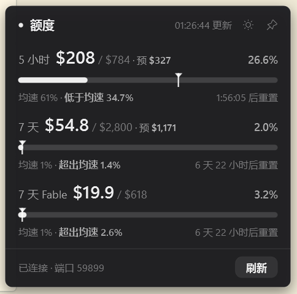
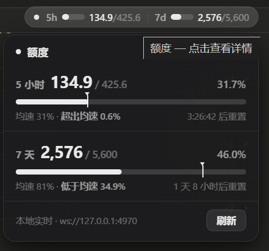

# mirasim-quota-widget

[Mirasim](https://mirasim.ai) 的 Windows **系统托盘额度监视器**:
三枚托盘圆环实时显示 **5 小时 / 7 天 / 7 天 Fable** 三个额度窗口的已用百分比,
点击弹出水墨面板——积分明细、**期末预估**、均速参考标、秒级重置倒计时。

零依赖单文件 PowerShell;不改动 Mirasim 客户端任何文件,任何版本可用,更新无感;
全部请求走本机回环,**零额度消耗**。




## 功能

**托盘:三枚独立图标(左→右 = 5h / 7d / Fable)**

- 每枚 = 贴边粗圆环 + 中央已用 % 数字;空位灰色,进度按任务栏明暗用白/黑水墨
- 阈值变色:**≥70% 变黄、≥90% 变红**
- 按托盘原生尺寸绘制,高 DPI 不发糊;悬停显示明细;点击任意一枚弹出面板
- Fable 专项池缺席(服务降级)时第三枚自动隐藏

**面板:水墨风格,逐像素透明圆角卡片 + 柔和阴影,快速缩放淡入淡出**

- 三窗口大字**美元金额**(已用 / 总可用)与百分比、进度条
- **积分耗尽金额预估**(5h/7d 金额旁「预 $N」,Fable 行不显示):这池积分被用完时,
  实际总共花掉多少美元——已用部分按**历史构成**换算(7d 用 fable 池存量精确分解,
  5h 用近 3 小时速率比近似),剩余积分按**当前 fable 与普通模型使用比例 φ**
  (≤3 小时回归速率比,缺采样退存量比)换算;fable 份 ÷480、普通份 ÷200。
  全用普通模型时 预=$总额,全用 fable 时 预=$总额÷2.4,随使用构成实时滑动
- **均速参考标**(三角 + 竖线):按窗口已流逝时间比例在进度条上打标,
  并给出「低于均速 x.x% / 超出均速 x.x%」
- **秒级走动的重置倒计时**;账户暂停 / 服务降级 / 不计量状态横幅
- 右上角:**白/黑主题切换**(记住选择,未手动切换时跟随系统)、**图钉置顶**(固定后点外不收)
- Esc 或点击他处自动收起;「刷新」按钮即时拉取

**数据与工程**

- 进程内枚举 Mirasim 监听端口 → `GET /v1/limits`(绝对 used / budget / reset_at 与状态位):
  **10 秒轮询**;打开面板或点刷新 **≤0.2 秒**即时拉取;界面 250ms 心跳
- 路由端口随服务端重启漂移 → 自动重枚举定位;断连时显示最后一次数据与时间(本地缓存兜底)
- 单实例互斥;开机自启;启动后预热渲染管线,首次打开面板即时弹出

## 安装

```powershell
git clone https://github.com/chiakinanam1/mirasim-quota-widget.git
cd mirasim-quota-widget
powershell -ExecutionPolicy Bypass -File install.ps1
```

install.ps1 会:修正脚本编码 → 注册开机自启(`HKCU\...\Run` 的 `MirasimQuotaTray`)→ 启动托盘。
图标可能落在托盘「隐藏图标」溢出区,点向上箭头展开后可拖到常驻区;三枚图标顺序也可拖动调整。

## 卸载

托盘右键 → 取消勾选「开机自启」→「退出」,即已干净卸载。
可顺手删除 `%LOCALAPPDATA%` 下的 `mirasim-quota-tray-cache.json`(数据缓存)与
`mirasim-quota-tray-theme.txt`(主题偏好)。

## 数据来源与原理

| 数据 | 来源 | 频率 |
|---|---|---|
| 三窗口 used / budget / reset_at 与状态位 | Mirasim 路由端口 `GET /v1/limits` | 10s 轮询;开面板/刷新即时 |
| 期末预估 | 上述采样的本地分段加权回归 | 随采样更新 |

美元换算(对 `/v1/limits` 增量做精确探针标定,误差 0):**普通模型 units = 200 × 牌价美元
(1 unit = $0.005),fable 模型 = 480 × 牌价美元**——5h/7d 混合池按 ÷200 折算,
7d Fable 专项池只进 fable 用量、按 ÷480 折算。
全部请求都在本机回环,不触发任何模型调用,不消耗账户额度。

## 旧版:应用内注入 widget(仅 ≤ 0.0.224)

仓库保留了此前的应用内实现(`quota-widget.js` + `probe-budget.ps1`):把 Apple 菜单栏风格的
额度胶囊注入 Mirasim 标题栏,点击弹出同款毛玻璃面板,碰撞感知定位、总额度自动校准。
**Mirasim 0.0.225 起注入通道被封死,该路线不再维护**;托盘版功能已完全覆盖并超出。



## 声明

非官方项目,依赖 Mirasim 未公开的本地接口(`/v1/limits`)。仅在本机读取你自己的额度数据,
新版本可能需要适配,风险自负。

MIT License
